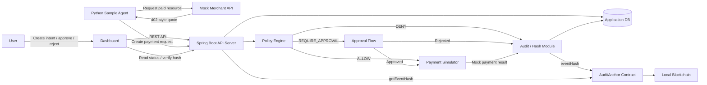
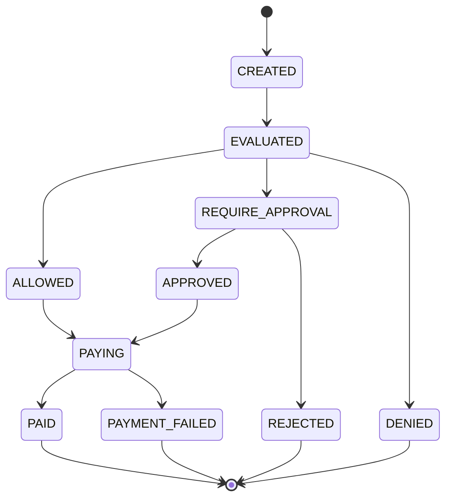

# AgentPay Guard 시스템 아키텍처

작성일: 2026-06-23  
상태: planned

## 목적

이 문서는 AgentPay Guard PoC를 실제 구현 가능한 시스템 구조로 정리한다.

AgentPay Guard는 AI Agent가 유료 리소스를 사용하려고 할 때, 사용자 intent와 예산 정책을 먼저 검증하고, 허용/승인/차단 결과를 감사 가능한 형태로 저장하는 게이트웨이이다.

이번 PoC는 실제 결제 시스템이 아니다. 실제 카드, 계좌, PG, 메인넷 결제, 실사용 지갑 관리는 구현하지 않는다. 결제는 mock으로 처리하고, 블록체인은 이벤트 원문이 아니라 eventHash를 기록하는 감사 레이어로만 사용한다.

## 한 줄 아키텍처

```text
Python Sample Agent
-> Mock Merchant의 402-style quote 수신
-> AgentPay Guard에 payment request 생성
-> Policy Engine 판단
-> 승인 또는 mock 결제
-> Audit DB 저장
-> AuditAnchor 컨트랙트에 eventHash 기록
-> Dashboard에서 결과와 hash 검증 확인
```

## 전체 구성



## 확정된 기술 선택

2026-06-24 기준 PoC 기술 선택은 다음과 같이 잡는다.

- DB: PostgreSQL
- Dashboard: React + TypeScript
- Mock Merchant: 1차 PoC에서는 Spring Boot API server 내부 모듈로 구현
- Blockchain: Hardhat local node 우선 사용
- Testnet: 제출 전 시간이 남을 때 optional로 배포 가이드 또는 Sepolia 배포를 검토
- eventHash: 정렬된 canonical JSON envelope를 SHA-256으로 해시
- 구현 프로젝트 구조: `opensource-competition` 저장소 루트 하위 디렉토리로 관리

이 결정의 기준은 PoC를 빠르게 end-to-end로 완성하면서도, 나중에 mock merchant 분리나 테스트넷 배포로 확장할 수 있는 구조를 유지하는 것이다.

## 프로젝트 디렉토리 구조

`opensource-competition` 저장소 안에 문서와 구현 프로젝트를 함께 둔다.

```text
opensource-competition/
  AGENTS.md
  docs/
  agentpay-guard-api-server/
    # Spring Boot backend
  agentpay-guard-dashboard/
    # React + TypeScript dashboard
  agentpay-guard-sample-agent/
    # Python sample agent
  agentpay-guard-audit-anchor/
    # Hardhat + Solidity contract
```

관계:

- `agentpay-guard-dashboard`는 사용자가 intent, payment request, approval, audit 결과를 볼 수 있게 `agentpay-guard-api-server`의 REST API를 호출한다.
- `agentpay-guard-sample-agent`는 mock merchant를 먼저 호출하고, quote를 받은 뒤 `agentpay-guard-api-server`에 payment request를 생성한다.
- `agentpay-guard-api-server`는 정책 판단, 승인, mock 결제, 감사 이벤트 저장을 담당하고, eventHash를 `agentpay-guard-audit-anchor` 컨트랙트에 기록한다.
- `agentpay-guard-audit-anchor`는 Hardhat local node에 배포되어 eventHash 저장과 조회만 담당한다.
- `opensource-competition`은 네 구현 프로젝트를 묶는 문서, 일정, 제출물, 실행 가이드를 관리한다.

## 구현 단위

### 1. API Server

planned 위치: `agentpay-guard-api-server`

역할:

- 사용자 intent API 제공
- agent 등록 API 제공
- payment request API 제공
- 정책 판단 실행
- 승인/거절 처리
- mock 결제 실행
- 감사 이벤트 생성
- AuditAnchor 컨트랙트 연동
- Dashboard 또는 Dashboard API 제공

초기 기술 선택안:

- Spring Boot
- Java 21 또는 Java 17
- JPA 기반 persistence
- PostgreSQL
- 컨트랙트 연동은 web3j 검토

확인 필요:

- Spring Boot 버전
- Java 버전
- web3j를 직접 사용할지, 백엔드에서 Hardhat/ethers 기반 스크립트를 호출할지 결정해야 한다.

### 2. Policy Engine

planned 위치: `agentpay-guard-api-server` 내부 모듈

1차 PoC에서는 규칙 기반으로 구현한다.

입력:

- payment intent
- payment request
- agent
- merchant quote
- 현재 누적 사용액
- 정책 설정값

검사 항목:

- intent 활성 상태
- intent 만료 여부
- merchant allowlist 포함 여부
- merchant blocklist 포함 여부
- category 허용 여부
- 단건 금액 한도
- 총 예산 초과 여부
- 승인 필요 금액 초과 여부
- reason의 prompt injection 의심 문구 포함 여부
- quote 중복 또는 이미 처리된 요청 여부

출력:

```text
ALLOW
REQUIRE_APPROVAL
DENY
```

정책 판단은 항상 `policy_decisions`에 저장한다. `DENY`도 감사 대상이다.

### 3. Mock Merchant API

planned 위치: `agentpay-guard-api-server` 내부 모듈

역할:

- 유료 리소스 요청 시 `402 Payment Required` 스타일 quote 반환
- quoteId, merchant, resource, amount, currency, quoteHash 제공
- mock 결제 완료 토큰 또는 simulated transaction id가 있으면 resource 데이터 반환

구현 원칙:

- 1차 PoC에서는 별도 앱으로 분리하지 않는다.
- Spring Boot 내부에 `merchantmock` 패키지 또는 모듈로 둔다.
- 외부 분리가 필요해질 경우 별도 `agentpay-guard-mock-merchant` 프로젝트로 이동할 수 있게 API 경계와 DTO를 명확히 둔다.

PoC 응답 예시:

```json
{
  "status": 402,
  "quoteId": "quote-weather-seoul-001",
  "merchant": "weather-api.local",
  "resource": "/premium/weather/seoul",
  "category": "weather",
  "amount": "0.10",
  "currency": "USD",
  "quoteHash": "sha256:..."
}
```

### 4. Payment Simulator

planned 위치: `agentpay-guard-api-server` 내부 모듈

역할:

- 실제 결제 대신 mock 결제 성공/실패 처리
- simulated transaction id 생성
- payment request 상태 변경
- payment result 저장
- 동일 payment request의 중복 결제 방지

상태 전이:

```text
APPROVED 또는 ALLOWED
-> PAYING
-> PAID 또는 PAYMENT_FAILED
```

### 5. Audit / Hash Module

planned 위치: `agentpay-guard-api-server` 내부 모듈

역할:

- 주요 이벤트 원문을 DB에 저장
- canonical JSON 생성
- SHA-256 기반 eventHash 생성
- AuditAnchor 컨트랙트에 eventHash 기록 요청
- DB eventHash와 온체인 hash 비교 검증

hash 대상 이벤트:

- intent
- payment_request
- policy_decision
- approval
- payment_result
- audit_anchor

원칙:

- 블록체인에는 원문을 올리지 않는다.
- 개인정보, 결제 상세 정보, API 응답 본문은 온체인에 올리지 않는다.
- canonical JSON 필드 순서와 timestamp 형식을 고정한다.

### 6. AuditAnchor Contract

planned 위치: `agentpay-guard-audit-anchor`

역할:

- eventId, eventType, eventHash를 온체인에 기록
- txHash를 통해 사후 검증 가능하게 함
- 원문 이벤트는 저장하지 않음

최소 Solidity 인터페이스:

```solidity
function anchorEvent(
    string calldata eventId,
    string calldata eventType,
    bytes32 eventHash
) external;

function getEventHash(string calldata eventId) external view returns (bytes32);
```

이벤트:

```solidity
event EventAnchored(
    string eventId,
    string eventType,
    bytes32 eventHash,
    address indexed anchoredBy,
    uint256 anchoredAt
);
```

### 7. Python Sample Agent

planned 위치: `agentpay-guard-sample-agent`

역할:

- mock merchant에 유료 리소스 요청
- `402 Payment Required` 스타일 quote 수신
- quote를 바탕으로 Guard에 payment request 생성
- 정책 결과 확인
- `ALLOW`이면 mock payment API 호출
- `REQUIRE_APPROVAL`이면 승인 대기 안내
- `PAID` 이후 merchant resource 재요청

PoC CLI 흐름:

```text
python agent.py --intent-id intent-001 --resource /premium/weather/seoul
```

### 8. Dashboard

planned 위치: `agentpay-guard-dashboard`

기술:

- React
- TypeScript
- Vite 검토
- REST API 기반 통신

필수 화면:

- Intent 목록/상세
- Payment Request 목록/상세
- 정책 판단 결과
- 승인/거절 버튼
- mock 결제 결과
- audit anchor 목록
- txHash
- hash verify 결과

PoC에서는 시연 가능성이 우선이다. 복잡한 분석 화면은 고도화 항목으로 둔다.

## 데이터 모델

### users

PoC에서는 단일 사용자 또는 seed 사용자로 시작 가능하다.

필드 후보:

- id
- display_name
- created_at

### agents

필드 후보:

- id
- name
- owner_user_id
- status
- created_at

### payment_intents

필드 후보:

- id
- user_id
- purpose
- total_budget_amount
- currency
- max_amount_per_request
- require_approval_over
- allowed_merchants
- blocked_merchants
- allowed_categories
- status
- expires_at
- created_at
- updated_at

### payment_requests

필드 후보:

- id
- intent_id
- agent_id
- quote_id
- merchant
- resource
- category
- amount
- currency
- reason
- quote_hash
- status
- created_at
- updated_at

상태 후보:

```text
CREATED
EVALUATED
ALLOWED
REQUIRE_APPROVAL
DENIED
APPROVED
REJECTED
PAYING
PAID
PAYMENT_FAILED
```

### policy_decisions

필드 후보:

- id
- payment_request_id
- decision
- reason_code
- reason_message
- policy_version
- evaluated_at

decision 후보:

```text
ALLOW
REQUIRE_APPROVAL
DENY
```

### approvals

필드 후보:

- id
- payment_request_id
- approver_user_id
- decision
- comment
- decided_at

decision 후보:

```text
APPROVED
REJECTED
```

### payment_results

필드 후보:

- id
- payment_request_id
- status
- simulated_transaction_id
- failure_reason
- paid_at

### audit_events

필드 후보:

- id
- event_type
- subject_id
- canonical_json
- event_hash
- created_at

### audit_anchors

필드 후보:

- id
- audit_event_id
- event_type
- event_hash
- chain_id
- contract_address
- tx_hash
- anchored_at
- verify_status

verify_status 후보:

```text
PENDING
MATCHED
MISMATCHED
FAILED
```

## API 설계 초안

### Intent

```text
POST /api/intents
GET /api/intents
GET /api/intents/{intentId}
```

### Agent

```text
POST /api/agents
GET /api/agents
```

### Payment Request

```text
POST /api/payment-requests
GET /api/payment-requests
GET /api/payment-requests/{paymentRequestId}
POST /api/payment-requests/{paymentRequestId}/evaluate
POST /api/payment-requests/{paymentRequestId}/approve
POST /api/payment-requests/{paymentRequestId}/reject
POST /api/payment-requests/{paymentRequestId}/pay
```

### Audit

```text
POST /api/audit-anchors/{eventType}/{eventId}
GET /api/audit-anchors
GET /api/audit-anchors/{anchorId}/verify
```

### Mock Merchant

API server 내부 구현 경로:

```text
GET /mock-merchant/resources/{resourceId}
POST /mock-merchant/resources/{resourceId}/redeem
```

## End-to-End 흐름

### 정상 허용

```text
1. 사용자가 intent를 생성한다.
2. Agent가 mock merchant에 유료 resource를 요청한다.
3. Mock merchant가 402-style quote를 반환한다.
4. Agent가 quote로 payment request를 생성한다.
5. Policy Engine이 merchant, 예산, 단건 한도, category를 검사한다.
6. 조건을 만족하면 ALLOW를 저장한다.
7. Payment Simulator가 mock 결제를 성공 처리한다.
8. audit event를 생성하고 eventHash를 컨트랙트에 기록한다.
9. Dashboard에서 PAID, txHash, verify MATCHED를 확인한다.
```

### 예산 초과 차단

```text
1. intent의 남은 예산보다 큰 payment request가 생성된다.
2. Policy Engine이 총 예산 초과로 DENY를 저장한다.
3. Payment Simulator는 실행하지 않는다.
4. DENY 이벤트의 eventHash를 기록한다.
5. Dashboard에서 차단 사유와 txHash를 확인한다.
```

### 승인 필요

```text
1. payment request 금액이 require_approval_over를 초과한다.
2. Policy Engine이 REQUIRE_APPROVAL을 저장한다.
3. Dashboard에서 승인/거절 버튼을 표시한다.
4. 승인 시 APPROVED 이벤트를 저장하고 mock 결제를 실행한다.
5. 거절 시 REJECTED 이벤트를 저장하고 결제는 실행하지 않는다.
6. 승인 또는 거절 이벤트 hash를 기록한다.
```

## 상태 전이 규칙



규칙:

- `DENIED`와 `REJECTED`에서는 결제를 실행하지 않는다.
- `PAID` 상태의 payment request는 다시 결제하지 않는다.
- 정책 판단은 payment request마다 최소 1회 저장한다.
- 재평가를 허용할 경우 policy version과 재평가 이력을 별도로 남긴다.

## 보안 경계

PoC에서 지킬 경계:

- Agent는 외부 API key를 직접 갖지 않는다.
- 실제 결제 credential은 사용하지 않는다.
- private key와 RPC URL은 `.env`로 관리하고 커밋하지 않는다.
- prompt injection 탐지는 단순 키워드 기반으로 구현하되, 완전한 방어라고 주장하지 않는다.
- 블록체인에는 eventHash만 올린다.
- mock merchant quote와 payment request는 quoteId와 quoteHash로 연결한다.

## eventHash canonical JSON 규칙

PoC에서는 다음 규칙을 기준으로 eventHash를 생성한다.

- JSON 인코딩은 UTF-8을 사용한다.
- pretty print를 사용하지 않는다.
- object key는 알파벳 오름차순으로 정렬한다.
- null 필드는 포함한다.
- timestamp는 ISO-8601 UTC 문자열을 사용한다.
- amount는 floating point number가 아니라 decimal 문자열로 저장한다. 예: `"0.10"`
- hash 대상에서 DB 자동증가 id, txHash, updated_at, verify_status는 제외한다.
- 해시 알고리즘은 SHA-256을 사용한다.

공통 envelope:

```json
{
  "eventId": "evt_...",
  "eventType": "POLICY_DECISION",
  "schemaVersion": "1",
  "subjectId": "payreq_...",
  "occurredAt": "2026-06-23T07:00:00Z",
  "payload": {
    "decision": "ALLOW",
    "reasonCode": "WITHIN_BUDGET"
  }
}
```

eventHash는 위 envelope를 canonical JSON으로 직렬화한 뒤 SHA-256으로 계산한다.

## 구현 우선순위

1. 저장소 기본 구조 생성
2. API server skeleton과 DB 모델 생성
3. intent, agent, payment request API 구현
4. Policy Engine 규칙 구현
5. Payment Simulator와 승인/거절 흐름 구현
6. Mock Merchant와 Python Sample Agent 구현
7. Audit event와 hash 생성 구현
8. AuditAnchor 컨트랙트와 로컬 배포 구현
9. API server와 컨트랙트 연동
10. Dashboard와 3개 시나리오 통합 검증

## POC 완료 기준

- 사용자가 intent를 등록할 수 있다.
- Python Agent가 mock merchant의 402-style quote를 받을 수 있다.
- Agent가 Guard에 payment request를 생성할 수 있다.
- Policy Engine이 `ALLOW`, `REQUIRE_APPROVAL`, `DENY`를 판단한다.
- 승인 필요 요청을 승인/거절할 수 있다.
- mock 결제 결과가 저장된다.
- 주요 이벤트 eventHash가 생성된다.
- AuditAnchor 컨트랙트에 eventHash가 기록된다.
- txHash와 hash verify 결과를 확인할 수 있다.
- 정상 허용, 예산 초과 차단, 승인 필요 시나리오가 모두 시연 가능하다.

## 확인 필요

- Spring Boot 버전과 Java 버전
- React 빌드 도구와 UI 라이브러리 사용 여부
- web3j 직접 연동과 Hardhat script 호출 방식 중 어떤 방식을 1차 구현으로 선택할지
- 테스트넷 배포를 제출 범위에 넣을지 optional 문서로만 둘지
