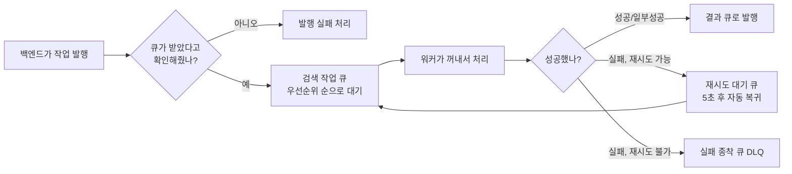

# RabbitMQ 활용 현황 점검

작성일: 2026-08-19
대상: "우리가 쓰는 메시지 큐(RabbitMQ)가 왜 필요했는지, 어떤 기능을 실제로 쓰고 있는지"가
궁금한 백엔드 개발자
전제: 전체 처리 흐름은 [크롤러·큐·백엔드·대시보드 전체 동작 프로세스](크롤러_큐_백엔드_대시보드_전체_동작_프로세스.md)
에서 다뤘고, 이 문서는 그중 **큐 하나만 따로 떼어서** "필요했는가"와 "기능을 얼마나
제대로 쓰고 있는가"를 점검한다.

## 1. 왜 메시지 큐가 필요했나

이 시스템이 풀어야 했던 문제 네 가지가 메시지 큐(RabbitMQ) 도입의 이유다.

| 문제 상황 | 큐로 해결한 방법 |
|---|---|
| 크롤링 담당 프로그램(워커)이 여러 종류(Python/Go)로 바뀌는 중이다 | 두 워커가 같은 대기열을 보고 있다가, 필요하면 다른 워커로 바로 교체할 수 있다 |
| 요청마다 급한 정도가 다르다 (구매 직전 재검증 vs 배경에서 미리 갱신) | 큐 안에서 우선순위 높은 작업이 먼저 처리되도록 순서를 조정한다 |
| 판매처 응답이 실패했을 때 바로 재시도하면 또 실패할 확률이 높다 | 몇 초 쉬었다가 자동으로 다시 대기열에 넣는다(지연 재시도) |
| 크롤링 한 건이 최대 30초 걸리는데 관리자는 바로 응답을 받아야 한다 | 요청을 큐에 넣고 "접수 확인"만 받으면 바로 응답, 실제 처리는 뒤에서 진행 |

**한 가지 짚어둘 점**: 요청은 큐로 보내기 *전에* 이미 DB에 "요청됨" 상태로 저장된다. 즉
"무엇을 요청했는지"에 대한 기록의 원천은 DB이지, RabbitMQ가 그 정보를 보관하는 유일한
곳은 아니다. **그렇다고 큐가 없어도 되는 구조라는 뜻은 아니다.** 위 표의 네 가지 문제
(비동기 분리, 우선순위, 지연 재시도, 워커 교체 유연성)는 여전히 큐가 있어야 풀리는
문제다. 만약 큐 없이 DB만으로 이 네 가지를 구현하려 하면, 결국 "우선순위 순으로 폴링해서
꺼내고, 실패하면 N초 후 재시도 대상으로 표시하고, 여러 워커가 같은 행을 동시에 집어가지
않게 락을 거는" 로직을 DB 테이블 위에 직접 만들어야 하는데, 이는 RabbitMQ가 이미 검증된
방식으로 해주는 일을 다시 만드는 셈이다. 그래서 정확한 평가는 "요청 기록의 원천은
DB이고, 큐는 그 위에서 비동기 처리·우선순위·재시도를 안전하게 맡아주는 필요한 장치"다.

## 2. 한눈에 보는 큐 처리 흐름

## 3. 지금 실제로 쓰고 있는 기능

| 기능 | 쉬운 설명 |
|---|---|
| 저장형 큐 + 저장형 메시지 | RabbitMQ 프로세스가 재시작돼도 큐와 그 안의 메시지가 사라지지 않는다 |
| 발행 확인(publisher confirm) | 메시지를 "보내기만" 하지 않고, 큐가 "진짜 받았다"고 응답할 때까지(최대 5초) 기다린 뒤에야 성공으로 처리한다 |
| 라우팅 실패 감지(mandatory + return) | 메시지가 어느 큐로도 가지 못하고 버려지면, 그 사실을 즉시 알 수 있게 되어 있다 |
| 우선순위 큐 | 작업마다 우선순위 값(최대 100)을 매겨서, 큐 안에서 우선순위 높은 작업이 먼저 나가도록 되어 있다 |
| 재시도 시에도 우선순위 유지 | 재시도로 다시 들어간 작업도 원래 우선순위를 그대로 유지한다. (예전에는 재시도할 때 우선순위가 초기화돼서, 재검증처럼 급한 작업도 한 번 실패하면 뒤로 밀리는 문제가 있었는데 이번에 고쳤다) |
| 지연 재시도(TTL + 실패 큐 조합) | 별도 프로그램 설치 없이, "5초짜리 대기실"에 잠깐 넣어뒀다가 시간이 지나면 자동으로 원래 큐로 돌려보내는 방식으로 재시도 지연을 구현했다 |
| 실패 종착 큐(DLQ) | 재시도를 다 써버린 작업이나 복구 불가능한 작업은 별도의 "실패함"으로 격리돼서, 정상 처리 흐름을 방해하지 않는다 |
| 한 번에 하나씩 처리(수동 확인) | 워커 하나는 메시지를 한 번에 1개만 받아서 처리하고, 처리를 완전히 끝낸 뒤에만 "처리 완료"를 큐에 알린다. 처리 중에 워커가 죽으면 그 메시지는 다른 워커나 재시작된 워커가 다시 처리하게 된다 |
| 자동 재연결 | 네트워크가 잠깐 끊겨도 워커와 백엔드가 큐 연결을 자동으로 복구한다 |
| 중복 요청 차단 | 같은 판매처+같은 검색 조건의 요청이 이미 대기 중이거나 처리 중이면, 새 요청은 큐에 넣지 않고 바로 거절한다. 이미 끝난 과거 요청은 막지 않는다 |
| 워커 종류 간 설정 일치 | Python 워커와 Java 백엔드가 큐 이름, 옵션 값들을 정확히 동일하게 선언해 둬서, 둘 중 어느 쪽이 먼저 켜져도 설정 충돌 없이 큐가 만들어진다 |

## 4. 코드는 있지만 기본값이 꺼져 있는 기능

| 기능 | 상태 | 설명 |
|---|---|---|
| 워커 여러 개를 동시에 띄워 처리량 늘리기 | 구조는 지원하지만 운영에서는 워커 1개만 실행 중 | 여러 개를 띄우면 큐가 알아서 작업을 나눠주는 구조이지만, 지금은 워커 종류를 바꾸는 전환 검증 기간이라 의도적으로 1개만 운영한다 |
| 두 번째 워커(Go)의 실제 가동 | 같은 큐를 볼 수 있도록 코드는 준비돼 있지만, 현재는 Python 워커만 켜져 있다 | 전환 검증이 끝나면 교체하거나 같이 운영할 수 있다 |
| 오래된 데이터 자동 재수집 스케줄러 | 완전히 구현돼 있지만 기본값이 꺼져 있음 | 설정 값 하나를 켜야 동작한다 |
| 판매처별 요청 속도 제한(Redis) | 완전히 구현돼 있지만 기본은 꺼져 있음(선택 사용) | 환경변수를 넣어야 켜진다. 꺼진 채로 워커를 여러 개 띄우면 판매처 쪽에서 본 전체 요청 속도가 제어되지 않을 수 있다 |
| 상세 조회 결과를 잠깐 기억해두는 캐시 | 큐를 통한 일반 처리 경로에서는 아예 쓰이지 않음 | 큐로 들어오는 작업은 이미 크기가 작아서(페이지 1개, 30초 제한) 필요 없고, 수동으로 대량 크롤링을 돌리는 별도 스크립트 전용 보조 기능이다 |

## 5. 앞으로도 당장은 필요 없어 보이는 기능

| 기능 | 코드에 없음 | 왜 없어도 되는가 |
|---|---|---|
| 큐를 여러 대에 복제해서 고가용성 확보 | 있음 | 지금은 RabbitMQ가 서버 한 대로만 돌고 있어서, 이 서버가 죽으면 큐도 잠깐 멈춘다. 지금 단계에서는 감안할 수 있지만, 실제 서비스로 전환할 때는 반드시 짚어야 할 부분이다 |
| 지연 메시지 전용 확장 기능 | 있음 | TTL + 실패 큐 조합으로 이미 지연 재시도를 구현했기 때문에 별도 확장 기능이 필요 없다 |
| 요청-응답(RPC) 패턴 | 있음 | 작업 상태 확인은 "짧게, 정해진 횟수만" 다시 조회하는 방식으로 이미 설계돼 있어서, 별도의 요청-응답 패턴이 필요 없다 |
| 조건에 따라 여러 큐로 나눠 보내는 라우팅 | 있음 | 지금은 요청 하나가 항상 정해진 큐 하나로만 가면 되는 구조라, 더 복잡한 라우팅 방식은 오히려 불필요한 복잡도가 된다 |
| 큐 자체의 중복 메시지 제거 기능 | 있음 | RabbitMQ가 기본으로 제공하는 기능이 아니기도 하고, 대신 §3의 "중복 요청 차단"을 DB 조회로 직접 구현해서 해결했다 |

## 6. 비동기 분리, 단건과 대량 요청 각각에 적용되는가

§1의 "HTTP 스레드의 비동기 분리"는 사실 **두 계층**으로 나눠서 봐야 정확하다.

- **계층 A — 큐 publisher confirm 분리**: HTTP 스레드는 "broker가 메시지를 받았다"(최대
  5초)까지만 기다리고, 실제 크롤링(최대 30초)은 기다리지 않는다. `CollectionTaskPublisher.
  publishTask()`가 하는 일(`CollectionTaskPublisher.java:203-230`).
- **계층 B — Spring `@Async` 스레드풀 분리**: HTTP 스레드는 "배치를 접수했다"까지만
  기다리고, 계층 A를 N번 반복하는 루프 자체는 기다리지 않는다. `BulkOfferVerificationRunner.
  runAsync()`가 하는 일(`BulkOfferVerificationRunner.java:49-63`).

| 요청 종류 | 진입점 | 계층 A(publisher confirm) | 계층 B(`@Async` 배치) | HTTP가 실제로 기다리는 것 |
|---|---|---|---|---|
| 단건 재검증 | `OfferVerificationService.request()` (`OfferVerificationService.java:69-88`) | 적용됨 — 건마다 최대 5초 confirm | 필요 없음 — 1건이라 5초면 충분 | confirm 1회(최대 5초) |
| 대량 재검증(최대 10,000건) | `BulkOfferVerificationRunner.runAsync()` | 적용됨 — 배치 내부에서 상품마다 여전히 `request()`를 그대로 호출하므로 건별로 동일하게 걸림 | 적용됨 — 컨트롤러는 배치를 `bulkVerificationExecutor` 스레드풀에 던지고 즉시 202 반환 | 배치 접수 확인만(ms 단위). 건별 confirm 대기(최대 5초×N)는 HTTP 스레드가 아니라 배경 스레드가 대신 부담 |
| 검색 수집(다중 페이지, `publishPages`) | `CollectionTaskPublisher.publishPages()` (`CollectionTaskPublisher.java:112-154`) | 적용됨 — 페이지마다 confirm | 적용됨(2026-08-19 추가) — `CollectionTaskPagePublishRunner.runAsync()`가 job 등록 이후의 발행 루프 전체를 `collectionPagePublishExecutor` 배경 스레드에서 처리 | job 등록 확인만(ms 단위). confirm 대기(페이지당 최대 5초 × 최대 200)는 배경 스레드가 부담 |

**정리하면**: 세 경로 모두 계층 A(publisher confirm)는 공통으로 쓰고, 계층 B(배경 스레드로
반복 발행 넘기기)는 "한 번의 API 호출이 confirm을 몇 번이나 순차로 기다려야 하는가"에 따라
필요 여부가 갈렸다. 단건은 애초에 1번뿐이라 계층 B가 필요 없고, 대량 재검증(최대
10,000건)과 다중 페이지 검색 수집(최대 200건)은 둘 다 반복 호출이라 계층 B를 추가했다.
두 계층 B 구현은 순환 참조를 피하려 같은 모양을 하고 있다 — 실제 발행 로직(대량 재검증은
`OfferVerificationService.request()`, 다중 페이지는 `CollectionTaskAmqpGateway.publish()`)을
별도 Bean으로 유지하고, `@Async` 러너는 그 Bean에만 의존하지 발행을 요청한 서비스 쪽으로는
의존하지 않는다.

## 7. 면접·발표에서 "RabbitMQ 왜/어떻게 썼냐"에 답할 때

단순히 "큐를 하나 뒀다"가 아니라 §1의 요구사항 4가지를 §3의 구체적 기능으로 풀었다는 점을
근거로 들면 된다.

| 요구사항 | 답변에 쓸 근거 |
|---|---|
| 비동기 분리 | publisher confirm으로 HTTP는 broker ACK(≤5초)만 기다리고, 실제 처리(≤30초)는 워커가 배경에서(§6 계층 A) |
| 우선순위 | `x-max-priority`로 재검증(100) > 반응형 갱신(30) > 기본 요청(20) > 배경 갱신(5) 순서 보장, 재시도해도 우선순위 유지(이번에 고친 버그) |
| 지연 재시도 | 별도 플러그인 없이 TTL(5초)+DLX 조합으로 자동 재투입 |
| 신뢰성 | manual ack + prefetch=1로 워커가 죽어도 메시지 유실 없음, DLQ로 복구 불가 작업 격리, idempotencyKey로 중복 발행 앱 레벨 차단 |

**솔직히 짚어야 할 약점**(평가자가 파고들 만한 질문과 답):
- RabbitMQ가 단일 노드(HA 없음) → "죽으면 큐 전체가 멈춘다, 프로덕션 전환 시 quorum queue로
  가야 한다"고 먼저 인정
- 워커도 현재 1개만 운영 → "Python→Go 전환 검증 기간이라 의도적으로 1개, 경쟁 소비자 구조
  자체는 코드로 지원"
- 상태의 원천은 사실 Postgres, RabbitMQ는 그 위의 배달 메커니즘 → "왜 Redis가 아니라
  RabbitMQ였나"엔 "우선순위 재정렬과 지연 재시도가 핵심 요구사항이라 브로커가 필요했다"로 답

## 8. 정리

신뢰할 수 있는 작업 큐에 필요한 핵심 기능들 — 메시지가 사라지지 않게 저장하기, 발행
확인, 라우팅 실패 감지, 우선순위, 지연 재시도, 실패 종착 큐, 한 번에 하나씩 안전하게
처리하기, 자동 재연결 — 은 전부 갖춰져 있고 제대로 동작한다.

§4의 "꺼져 있는 기능"은 대부분 **지금이 워커 전환을 검증하는 과도기라 일부러 꺼둔 것**이고,
§5의 "아예 없는 기능"은 **지금 요구사항에 안 맞아서 만들지 않은 것**이다. 이 둘을
헷갈리지 않는 게 중요하다 — §4는 설정 하나만 켜면 바로 쓸 수 있는 완성된 기능이고, §5는
필요해지면 그때 새로 설계해야 하는 기능이다.

실제 서비스로 전환하는 걸 논의한다면, 우선순위는 §4(특히 워커 여러 개 동시 운영, 속도
제한 기능 켜기)가 먼저고, §5의 고가용성 큐 구성은 그다음이다.
