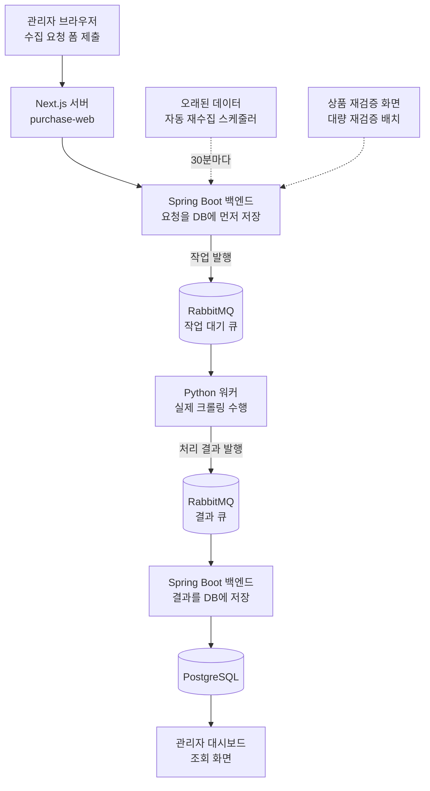

# 상품 수집 요청, 큐를 거쳐 처리되기까지의 전체 흐름

작성일: 2026-08-19
대상: 프로젝트를 처음 보거나, "관리자가 수집 요청을 누르면 실제로 무슨 일이 일어나는지"를
큐 중심으로 훑어보고 싶은 백엔드 개발자
전제: 이 문서는 코드 한 줄 한 줄을 추적하는 문서가 아니라, **인프라 관점에서 요청 하나가
어떤 시스템을 거쳐 흘러가는지**를 순서대로 설명하는 문서다. 더 세부적인 코드 위치가
필요하면 각 절 끝의 관련 파일 경로를 참고한다.

## 1. 한눈에 보는 전체 흐름

큐를 쓰는 이유는 단순하다. **크롤링 한 건은 최대 30초까지 걸릴 수 있는데, 관리자가 요청
버튼을 누른 순간 브라우저가 30초씩 기다리게 할 수는 없다.** 그래서 백엔드는 "요청을
받았다"는 확인만 큐에게서 받고 바로 응답하고, 실제 크롤링은 워커가 뒤에서 순서대로
처리한다. 진행 상황과 결과는 나중에 대시보드를 새로고침해서 확인하는 구조다.

---

## 2. 1단계 — 관리자가 요청을 등록하면 무슨 일이 일어나나

1. 관리자가 판매처/검색어/페이지 범위/필터를 입력하고 폼을 제출한다. 이때 자바스크립트
   `fetch`가 아니라 **브라우저의 진짜 폼 제출**을 쓴다 — 보안 소프트웨어나 확장 프로그램이
   `fetch`/`XHR` 요청을 막아버리는 경우에도 동작하게 하려는 선택이다.
2. Next.js 서버가 폼 데이터를 JSON으로 바꿔서 백엔드 API(`/internal/v1/collection-tasks/pages`)
   를 호출한다.
3. 백엔드는 **큐에 작업을 보내기 전에 먼저 DB에 "요청됨(QUEUED)" 상태로 저장한다.** 이렇게
   하는 이유는, 만약 큐 시스템이 잠깐 멈춰 있더라도 "무엇을 요청했는지"라는 기록만큼은
   DB에 항상 남기 위해서다.
4. 요청한 페이지 수만큼 작업을 쪼갠다. **페이지 1개 = 큐 메시지 1개**다. 예를 들어 3페이지를
   요청하면 메시지 3개가 만들어진다.
5. 메시지를 하나씩 큐로 보내면서, 큐가 "정말로 받았다"는 응답(발행 확인)을 최대 5초까지
   기다린다. 그냥 보내고 끝내는 게 아니라 **받았다는 확인까지 받아야 성공으로 친다.** 만약
   확인을 못 받으면 그 작업은 "발행 실패" 상태로 표시하고, 이미 보낸 나머지 작업은 그대로
   둔다.

**우선순위**: 모든 요청이 같은 순서로 처리되는 게 아니라, 상황에 따라 먼저 처리되도록
순위를 매긴다.

| 요청 종류 | 우선순위(숫자가 클수록 먼저 처리) |
|---|---|
| 배경에서 자동으로 오래된 데이터 미리 갱신 | 5 (가장 낮음) |
| 관리자가 등록한 일반 수집 요청 | 20 (기본값) |
| 사용자가 지금 기다리고 있는 반응형 갱신 | 30 |
| 구매 직전 최종 재검증 | 100 (가장 높음) |

관련 파일: `frontend/purchase-web/app/admin/collections/new/`,
`frontend/purchase-web/app/api/collection-tasks/handler.ts`,
`services/product-backend/.../collection/controller/CollectionTaskController.java`,
`services/product-backend/.../collection/service/CollectionTaskPublisher.java`

---

## 3. 큐 구조 — RabbitMQ 안에는 뭐가 있나

큐를 "대기실"이라고 생각하면 이해하기 쉽다. 이 프로젝트는 목적이 다른 대기실 3개를 쓴다.

| 큐(대기실) | 역할 | 쉬운 설명 |
|---|---|---|
| 검색 작업 큐 | 워커가 처리할 작업이 기다리는 곳 | 우선순위가 높은 작업이 먼저 나간다 (숫자가 큰 순서) |
| 재시도 대기 큐 | 실패한 작업이 잠깐 쉬었다 돌아오는 곳 | 5초 동안 여기서 대기한 다음 자동으로 검색 작업 큐로 돌아간다 |
| 실패 종착 큐(DLQ) | 재시도를 다 써버렸거나 복구 불가능한 작업이 가는 곳 | 여기 쌓인 작업은 자동으로 다시 처리되지 않으므로, 사람이 나중에 원인을 확인해야 한다 |

결과를 돌려받는 쪽도 구조가 같다: 정상 결과가 쌓이는 **결과 큐**와, 결과 처리 자체가
실패했을 때 쌓이는 **결과 실패 큐**가 따로 있다.

**재시도가 어떻게 동작하나**: 워커가 크롤링에 실패했는데 "일시적인 오류"(타임아웃, 판매처
서버 오류, 순간적인 접속 실패 등)로 판단되면, 그 작업을 재시도 대기 큐로 다시 보낸다.
5초가 지나면 자동으로 원래 검색 작업 큐로 돌아와서 다시 처리된다. **이때 원래 갖고 있던
우선순위도 그대로 유지된다** — 재검증처럼 우선순위 100으로 들어온 작업이 재시도를 거친다고
해서 뒤로 밀리면 안 되기 때문이다. (예전에는 재시도할 때 우선순위가 초기화되는 문제가
있었는데, 이번에 고쳤다.)

**같은 요청이 중복으로 쌓이는 것도 막는다**: 판매처+검색조건이 완전히 같은 요청이 이미
처리 중(대기 중이거나 실행 중)이면, 새 요청은 큐에 넣지 않고 바로 거절한다. 이미 끝난
과거 요청은 막지 않으므로 "다시 수집해줘"라는 재요청은 정상적으로 처리된다.

관련 파일: `purchase-research-agent/app/messaging/rabbitmq.py`,
`services/product-backend/.../collection/messaging/CollectionQueueNames.java`,
`services/product-backend/.../collection/config/RabbitCollectionConfiguration.java`

---

## 4. 2단계 — 워커가 큐에서 작업을 꺼내 크롤링한다

1. 워커는 큐에서 메시지를 하나 받으면, 가장 먼저 "지금 처리 시작했어요(running)"라는
   상태 메시지를 결과 큐로 보낸다. 이걸 받은 백엔드는 대시보드에 "처리 중"으로 표시한다.
2. 실제 크롤링을 진행한다. 작업 하나는 **정확히 페이지 1개, 상품 최대 50개**로 크기가
   작게 고정되어 있고, 최대 30초까지만 기다린다. 시간 안에 못 끝내면 타임아웃으로 실패
   처리하고 재시도 대상이 된다.
3. 판매처마다 크롤링 방식이 조금씩 다르다.
   - **ABC마트**: 판매처의 검색 API(JSON)와 실제 브라우저로 렌더링한 화면(HTML) 두 가지를
     동시에 가져와서 서로 내용이 일치하는지 비교 검증한다.
   - **29CM**: 목록은 API(JSON)로 받고, 상품 각각의 상세 페이지에서 별도로 정보를 가져와
     비교 검증한다.
4. 검증까지 끝나면 결과를 백엔드가 이해할 수 있는 형식으로 바꿔서 결과 큐로 보낸다.
5. 판매처 응답이 재시도로 해결될 수 있는 오류(타임아웃, 요청 제한, 서버 일시 오류)인지,
   아니면 재시도해도 소용없는 오류(잘못된 요청, 접근 차단)인지 구분해서, 전자만 재시도
   대상으로 표시한다.

**판매처에 너무 빠르게 요청하지 않도록 속도 제한도 걸려 있다.** 워커를 여러 개 띄우더라도
판매처 입장에서 본 전체 요청 속도가 일정 수준을 넘지 않도록 Redis로 전체 워커가 공유하는
속도 제한 장치를 둘 수 있다(다만 기본값은 꺼져 있고, 필요할 때 켜서 쓰는 옵션이다).

관련 파일: `purchase-research-agent/app/messaging/processor.py`,
`purchase-research-agent/app/crawlers/abcmart/crawler.py`,
`purchase-research-agent/app/crawlers/cm29/crawler.py`,
`purchase-research-agent/app/services/rate_limiter.py`

---

## 5. 3단계 — 결과가 다시 백엔드로 돌아와 저장된다

1. 백엔드가 결과 큐를 소비해서 메시지를 받으면, 먼저 형식이 올바른지 검증한다.
2. 상태에 따라 처리가 갈린다.
   - `running` → 작업 상태를 "처리 중"으로만 갱신
   - `failed` → 작업을 "실패"로 기록
   - `success`/`partial`(일부 경고 있음) → 실제 상품 데이터를 DB에 저장하고 작업을 "완료"로
     기록
3. 상품을 저장할 때는 "같은 상품이면 갱신, 새 상품이면 새로 생성" 방식을 쓴다. 다만
   **가격/재고/평점 같은 값은 덮어쓰지 않고 매번 새 기록으로 계속 쌓는다.** 그래야
   "이 상품 가격이 언제 얼마였는지" 이력을 나중에도 확인할 수 있다.
4. 저장과 작업 상태 갱신은 하나의 트랜잭션으로 묶여 있어서, 둘 중 하나만 반영되는 경우는
   없다.

**작업/전체 요청 상태값**

| 대상 | 상태값 흐름 |
|---|---|
| 전체 요청(job) | 요청됨 → 처리 중 → 완료 \| 일부 완료 \| 실패 |
| 개별 작업(task, 페이지 1개 단위) | 요청됨 → 처리 중 → 성공 \| 일부 성공 \| 실패 \| 발행 실패 |

관련 파일: `services/product-backend/.../collection/service/CollectionResultMessageService.java`,
`services/product-backend/.../collection/service/CollectorResultStoreService.java`,
`services/product-backend/.../collection/service/CollectionJobService.java`

---

## 6. 4단계 — 관리자 대시보드에서 확인한다

| 화면 | 하는 일 |
|---|---|
| 수집 현황 | 최근 요청 이력, 판매처별 수집 상품 수, 검증 일치율을 보여준다. 실패/일부 실패 요청은 같은 조건으로 재실행 버튼을 누를 수 있다 |
| 새 수집 요청 | 판매처/검색어/페이지범위/필터를 입력해 새 요청을 등록한다 |
| 상품 재검증 | 마지막 수집이 오래된 상품을 골라 재검증을 요청하고, 처리 진행률을 확인한다 |

공통 원칙: 모든 화면이 `fetch` 대신 **진짜 폼 제출 + 페이지 이동** 방식으로 동작한다.
그래서 처리 결과는 항상 페이지 주소(`?created=`, `?error=`, `?retried=`, `?batchId=` 등)에
담겨 전달되고, 화면은 그 값을 읽어 안내 배너를 보여준다.

---

## 7. 부가 기능들

### 7-1. 오래된 데이터 자동 재수집

- 사용자가 검색했을 때 마지막 수집이 24시간을 넘었으면(설정 가능) "오래됨"으로 판단해
  우선순위 30으로 즉시 다시 수집한다. 사용자가 실시간으로 기다리는 경로라 우선순위를
  높게 둔다.
- 그와 별개로, **30분마다 한 번씩** 오래된 검색 조건들을 미리 찾아 우선순위 5(가장 낮음)로
  조용히 다시 수집해 두는 스케줄러도 있다. 사용자가 오기 전에 미리 데이터를 채워 두면
  실제 검색할 때 기다리는 시간이 줄어드는 효과가 있다. 다만 이 스케줄러는 기본값이
  꺼져 있고, 설정으로 켜야 동작한다.

관련 파일: `services/product-backend/.../collection/service/CollectionRefreshService.java`,
`services/product-backend/.../collection/service/CollectionFreshnessScheduler.java`

### 7-2. 구매 직전 재검증(상품 1건)

상품 상세를 보여주기 직전, 가격/재고가 그사이 바뀌지 않았는지 확인하고 싶을 때 쓴다.
특별한 API가 아니라 **같은 상품명을 검색어로 하는 일반 수집 요청을 우선순위 100(가장
높음)으로 발행**하는 것뿐이다. 요청 당시의 가격/재고를 "기준값"으로 저장해 두고, 새 결과가
오면 기준값과 비교해서 "변경 없음" 또는 "변경됨"을 알려준다.

관련 파일: `services/product-backend/.../evidence/service/OfferVerificationService.java`

### 7-3. 대량 재검증(수백~수천 건)

관리자가 상품 재검증 화면에서 상품을 수백~수천 건 한꺼번에 고를 수 있다. 이걸 한 번에
동시 처리하면 안 된다 — 상품 하나당 큐 발행 확인을 최대 5초까지 기다리므로, 그대로
처리하면 HTTP 요청이 몇 분씩 응답하지 않게 된다. 그래서 **접수(즉시 응답)** 와
**처리(뒤에서 순서대로 진행)** 를 분리했다.

1. 관리자가 상품들을 선택해 제출하면, 백엔드는 배치 ID를 하나 만들고 즉시 "접수됐다"고
   응답한다(202 Accepted).
2. 실제 처리는 별도 스레드에서 상품을 **한 번에 하나씩 순서대로** §7-2와 같은 방식으로
   재검증 요청을 큐에 발행한다. 중간에 일부가 실패해도 나머지 처리는 멈추지 않는다.
3. 관리자는 진행 상태 조회 API로 "N건 중 M건 처리됨, K건 큐 등록 성공"을 확인할 수 있고,
   페이지를 새로고침하면 최신 진행률을 다시 볼 수 있다(자동 갱신은 아니고 수동 새로고침).

**주의**: 이 진행률은 서버 메모리에만 저장돼서 서버를 재시작하면 진행률 기록 자체는
사라진다. 하지만 이미 큐에 발행된 작업과 DB에 저장된 재검증 요청은 별도로 안전하게
남아 있으므로, 실제 데이터가 유실되는 것은 아니다.

관련 파일: `services/product-backend/.../evidence/controller/OfferVerificationController.java`,
`services/product-backend/.../evidence/service/BulkOfferVerificationRunner.java`,
`services/product-backend/.../evidence/service/BulkVerificationBatchTracker.java`

---

## 8. 서비스 간 주고받는 데이터 형식(계약)

Python 워커와 Spring Boot 백엔드는 서로 다른 언어로 만들어져 있지만, 큐로 주고받는
메시지의 형식(JSON Schema)은 `contracts/` 폴더에 한 곳에서 정의해 두고 양쪽이 똑같이
그 정의를 읽어 검증한다. 형식이 바뀌면 Schema, 각 언어의 DTO, 테스트를 같은 작업에서
함께 고치는 것이 원칙이다.

| 계약 | 방향 | 핵심 내용 |
|---|---|---|
| 수집 작업 요청 | 백엔드 → 큐 → 워커 | 판매처, 페이지, 우선순위, 시도 횟수, 중복 방지 키, 검색 조건 |
| 수집 결과 | 워커 → 큐 → 백엔드 | 처리 상태(진행중/성공/일부성공/실패), 상품 목록, 오류 정보 |

---

## 9. 참고 문서

- 큐 기능을 얼마나 실제로 쓰고 있는지 점검한 문서: [RabbitMQ 활용 현황 점검](RabbitMQ_활용_현황_점검.md)
- 컴포넌트 단위 아키텍처 개요: [Purchase Research Agent 시스템 구조](Purchase_Research_Agent_시스템_구조.md)
- DB 저장 설계의 배경: [현재 수집 데이터와 DB 저장 흐름](현재_수집_데이터와_DB_저장_흐름.md)
- 판매처 공통 수집 데이터 명세: [판매처 공통 수집 데이터 명세](판매처_공통_수집_데이터_명세.md)
