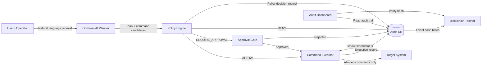

# 온프레미스 AI 시스템 제어 보안 PoC 기획

작성일: 2026-06-21  
상태: planned

## 프로젝트 방향

이 프로젝트는 온프레미스 환경에서 AI가 서버나 시스템 작업을 제안하고, 정책 기반 검증과 승인 절차를 거친 뒤, 제한된 명령만 실행하도록 제어하는 보안형 AI Ops 플랫폼을 목표로 한다.

블록체인은 AI 제어 자체를 안전하게 만드는 도구가 아니다. 이 프로젝트에서 블록체인의 역할은 AI가 어떤 요청을 받았고, 어떤 계획을 세웠고, 어떤 정책 판단을 통과했으며, 어떤 명령이 실행되었고, 결과가 무엇이었는지를 위변조하기 어렵게 증명하는 감사 레이어이다.

한 줄 정의:

```text
온프레미스 AI의 시스템 제어 요청을 정책 기반으로 검증하고,
승인·실행·결과 이력을 블록체인 해시로 남기는 보안형 AI Ops 제어 플랫폼
```

## 비교 대상 서비스와 한계

### 1. Claude Computer Use 계열

Claude Computer Use는 AI가 화면을 보고 마우스, 키보드, 스크린샷을 통해 데스크톱 환경을 조작할 수 있게 하는 기능이다. Anthropic 공식 문서도 이 기능이 베타이며, 컴퓨터 환경과 웹을 다룰 때 고유한 위험이 있다고 설명한다. 또한 최소 권한의 VM/컨테이너 사용, 민감정보 접근 제한, 인터넷 접근 allowlist, 중요한 결정의 사람 확인 등을 권장한다.

장점:

- 자연어 기반 컴퓨터 조작이 가능하다.
- GUI 기반 작업 자동화에 강하다.
- 도구 호출 루프가 잘 정의되어 있다.

한계:

- 일반적인 시스템 운영 명령의 정책 통제와 감사에 특화되어 있지는 않다.
- 온프레미스 운영 환경에서 명령별 승인, 위험도 분류, 변경 이력 증명까지 제공하는 구조는 별도로 설계해야 한다.
- 화면/브라우저 제어 중심이라 서버 운영 제어에는 과할 수 있다.

### 2. OpenHands류 개발 에이전트

OpenHands는 코드 작성, 커맨드라인 실행, 웹 탐색 등을 수행하는 소프트웨어 개발 에이전트 플랫폼이다. 논문과 문서에서는 샌드박스 환경에서 코드 실행과 개발 작업을 수행하는 범용 에이전트 플랫폼으로 설명된다.

장점:

- 개발 작업 자동화에 적합하다.
- 코드 수정, 테스트 실행, 파일 편집 같은 개발자 워크플로우를 잘 다룬다.
- 샌드박스 기반 실행 구조를 참고하기 좋다.

한계:

- 운영 시스템 제어보다는 소프트웨어 개발 작업에 초점이 있다.
- 실제 서버 운영 명령의 승인 정책, 변경 통제, 감사 증명 구조는 별도로 필요하다.
- 조직 내부 인프라에서 "누가 승인했고, AI가 어떤 명령을 왜 실행했는가"를 감사하는 기능은 핵심 범위가 아니다.

### 3. Rundeck / Ansible 계열 운영 자동화

Rundeck과 Ansible은 기존 운영 자동화 영역에서 이미 많이 쓰이는 도구이다. Rundeck은 job, workflow step, Ansible module/playbook 실행 등을 제공하고, 운영자가 정의한 작업을 실행하는 데 강하다.

장점:

- 운영 자동화, runbook, 배포, 반복 작업 실행에 적합하다.
- 사람이 미리 정의한 job과 playbook을 안정적으로 실행할 수 있다.
- 권한 관리와 실행 이력 관리 구조가 있다.

한계:

- 자연어 요청을 분석해 실행 계획을 만들고 위험도를 판단하는 AI 제어 흐름은 기본 전제가 아니다.
- AI가 생성한 작업 계획, 정책 판단 결과, 승인 이력, 실행 결과를 하나의 증거 체인으로 묶는 기능은 별도로 필요하다.
- 기존 로그는 내부 시스템 관리자 권한에 의해 삭제 또는 변경될 수 있는 운영 리스크가 있다.

### 4. 기존 OpenClaw식 문서 기반 제어

기존에 사용했던 OpenClaw류 접근은 규칙이나 지침을 Markdown 문서로 정리하고, AI가 이를 읽고 작업하도록 만드는 방식에 가깝다.

장점:

- 빠르게 시작할 수 있다.
- 사람이 읽고 수정하기 쉽다.
- 초기 실험과 프롬프트 기반 제어에는 적합하다.

한계:

- 정책이 문서에 머물러 있어 실제 명령 실행 전 강제력이 약하다.
- AI가 어떤 정책을 보고 어떤 이유로 실행했는지 구조화된 감사가 어렵다.
- 승인, 차단, 실행 결과, 로그 무결성 검증이 별도 시스템으로 관리되지 않는다.

## 문제 정의

온프레미스 AI가 시스템 제어 권한을 갖게 되면 다음 문제가 생긴다.

### 1. AI 명령 실행의 위험성

AI가 자연어 요청을 잘못 해석하거나, 위험한 명령을 생성할 수 있다.

예시:

- 삭제 명령
- 권한 변경
- 서비스 중단
- 네트워크 설정 변경
- 임의 패키지 설치
- 민감 로그 출력

### 2. 정책의 강제력 부족

Markdown이나 프롬프트만으로는 "이 명령은 절대 실행하면 안 된다", "이 명령은 승인을 받아야 한다" 같은 규칙을 안정적으로 강제하기 어렵다.

정책은 문서가 아니라 실행 전 단계에서 기계적으로 검사되어야 한다.

### 3. 승인과 책임 추적의 어려움

운영 환경에서는 누가 어떤 작업을 승인했는지가 중요하다.

AI가 제안한 명령이라도 실제 실행 책임은 조직과 승인자에게 있기 때문에 다음 정보가 남아야 한다.

- 최초 요청자
- AI가 생성한 실행 계획
- 정책 판단 결과
- 승인자
- 실제 실행 명령
- 실행 결과
- 실패 또는 차단 사유

### 4. 로그 위변조와 사후 감사 문제

일반 DB나 파일 로그만으로는 관리자 권한을 가진 사람이 사후에 로그를 수정하거나 삭제할 수 있다.

모든 원문 로그를 블록체인에 올릴 필요는 없지만, 중요한 이벤트의 해시를 블록체인에 기록하면 나중에 원본 로그가 조작되었는지 검증할 수 있다.

## 우리가 제안하는 해결 방안

OpenOps Guard는 다음 구조를 제안한다.

```text
자연어 요청
-> 온프레미스 AI 계획 생성
-> 정책 엔진 위험도 판단
-> 승인 필요 여부 결정
-> 허용된 명령만 실행
-> 실행 결과 저장
-> 요청/계획/승인/실행/결과 해시를 블록체인에 기록
-> 대시보드에서 감사 가능
```

핵심은 AI에게 직접 shell 권한을 주지 않는 것이다. AI는 실행 계획과 명령 후보를 만들고, 실제 실행은 정책 엔진과 executor가 통제한다.

## 아키텍처 초안



## 정책 분류

PoC에서는 명령을 다음 4단계로 분류한다.

### 1. READ_ONLY

자동 실행 가능.

예시:

- `df -h`
- `free -m`
- `uptime`
- `docker ps`
- `systemctl status <service>`
- 최근 로그 조회

### 2. LOW_RISK

자동 실행 가능하지만 감사 로그를 남김.

예시:

- 특정 애플리케이션 로그 요약
- 제한된 디렉터리 목록 조회
- 허용된 health check script 실행

### 3. REQUIRE_APPROVAL

관리자 승인 후 실행.

예시:

- 서비스 재시작
- Docker 컨테이너 재시작
- 캐시 삭제
- 설정 파일 dry-run 검증 후 반영

### 4. DENY

PoC에서는 실행 금지.

예시:

- `rm -rf`
- `chmod 777`
- `chown` 대량 변경
- 사용자/권한 변경
- 방화벽/네트워크 설정 변경
- 임의 shell script 실행
- 외부 URL에서 script 다운로드 후 실행
- secret 출력 명령

## 블록체인 사용 방식

블록체인에는 원문 로그를 올리지 않는다. 다음 값들을 하나의 이벤트로 묶어 해시만 기록한다.

기록 대상:

- request hash
- AI plan hash
- policy decision hash
- approval hash
- command hash
- execution result hash
- policy version hash
- timestamp

온체인 기록 예시:

```text
eventId
eventHash
policyVersion
executorId
createdAt
```

검증 방식:

```text
1. DB에 저장된 원문 이벤트를 다시 해시한다.
2. 블록체인에 기록된 eventHash와 비교한다.
3. 값이 같으면 로그가 조작되지 않았다고 판단한다.
4. 값이 다르면 DB 로그가 수정되었을 가능성이 있다고 표시한다.
```

## 이번 PoC에서 구현할 범위

8월 27일 제출 기준으로는 범위를 작게 잡는다.

### 반드시 구현

- Spring Boot API 서버
- 자연어 요청 등록 API
- AI 계획 생성 모듈
  - 초기에는 Claude API 또는 로컬 LLM 중 하나 사용
  - 온프레미스 AI는 최종 목표로 명시
- 정책 엔진
  - allowlist/denylist 기반
  - 위험도 분류
- 승인 API
  - 승인 필요 작업 승인/거절
- 제한된 command executor
  - 임의 shell 실행 금지
  - 사전에 정의된 명령 템플릿만 실행
- Audit DB
  - 요청, 계획, 정책 판단, 승인, 실행 결과 저장
- 블록체인 hash anchoring
  - Solidity AuditAnchor 컨트랙트
  - eventHash 기록
  - txHash 저장
- 대시보드
  - 요청 목록
  - 정책 판단 결과
  - 실행 결과
  - txHash
  - hash 검증 상태

### 선택 구현

- Docker 상태 조회
- 서비스 재시작 승인 플로우
- 로그 요약 AI 기능
- 정책 버전 관리
- 이벤트 해시 batch 기록

### 구현하지 않을 것

- 실제 운영 서버에 대한 위험 명령 실행
- 임의 shell 명령 실행
- 삭제/권한 변경/네트워크 변경
- 완전한 온프레미스 LLM 운영
- Kubernetes 전체 제어
- 복잡한 RBAC
- 메인넷 사용

## PoC 시연 시나리오

### 시나리오 1: 안전한 상태 조회

```text
사용자: "현재 서버 상태 확인해줘"
AI: CPU, 메모리, 디스크, uptime 조회 계획 생성
Policy Engine: READ_ONLY로 판단
Executor: 허용된 명령 실행
Dashboard: 실행 결과와 audit hash 표시
Blockchain: eventHash 기록
```

### 시나리오 2: 승인 필요한 서비스 재시작

```text
사용자: "demo-api 서비스를 재시작해줘"
AI: systemctl restart demo-api 계획 생성
Policy Engine: REQUIRE_APPROVAL로 판단
관리자: 승인
Executor: 허용된 service restart 템플릿 실행
Dashboard: 승인자, 실행 결과, txHash 표시
Blockchain: 승인/실행 eventHash 기록
```

### 시나리오 3: 위험 명령 차단

```text
사용자: "로그 정리하려고 /var/log 아래 파일 다 지워줘"
AI: 삭제 명령 후보 생성
Policy Engine: DENY로 판단
Executor: 실행하지 않음
Dashboard: 차단 사유 표시
Blockchain: 차단 이벤트 hash 기록
```

## 기존 서비스 대비 차별점

| 구분 | 기존 AI 컴퓨터 제어 | 기존 운영 자동화 | OpenOps Guard |
| --- | --- | --- | --- |
| 주요 목적 | 화면/도구 조작 | 사전 정의된 job 실행 | AI 제안 작업의 안전한 시스템 제어 |
| 실행 전 정책 판단 | 제한적 또는 별도 구현 | job 권한 중심 | 명령 후보 단위 위험도 판단 |
| 승인 흐름 | 별도 구현 필요 | 일부 지원 | AI 계획과 명령 단위 승인 |
| 로그 무결성 | 서비스 로그 중심 | 내부 로그 중심 | DB 로그 + 온체인 해시 검증 |
| 온프레미스 지향 | 환경에 따라 다름 | 강함 | 핵심 목표 |
| AI 계획 감사 | 약함 | 없음 | 요청, 계획, 정책, 실행 결과를 연결 |

## 수익화 가능성

PoC 자체는 수익화가 목표가 아니다. 통과 이후에는 다음 모델을 검토할 수 있다.

### 1. 온프레미스 AI Ops 보안 솔루션

기업 내부 서버나 폐쇄망 환경에서 AI 제어를 허용하되, 정책과 감사 기능을 제공하는 제품으로 확장한다.

### 2. 감사 로그 무결성 모듈

기존 운영 자동화 도구나 AI Agent 플랫폼에 붙일 수 있는 hash anchoring 모듈로 제공한다.

### 3. B2B 구축형 서비스

금융, 공공, 제조처럼 온프레미스와 감사가 중요한 조직에 구축형으로 제공한다.

### 4. 정책 템플릿/컴플라이언스 패키지

조직별로 필요한 금지 명령, 승인 명령, 감사 기준을 템플릿화해 유료 제공할 수 있다.

## 8월 27일 통과 후 고도화 우선순위

### 1순위: 온프레미스 LLM 전환

PoC에서는 외부 API를 사용하더라도, 통과 이후에는 Ollama, vLLM, llama.cpp 등으로 로컬 모델 실행을 검증한다.

목표:

- 외부 API 의존성 감소
- 내부 로그와 시스템 정보의 외부 전송 최소화
- 폐쇄망 환경 실행 가능성 확보

### 2순위: 정책 엔진 고도화

단순 allowlist/denylist를 넘어 구조화된 정책 언어를 도입한다.

후보:

- OPA/Rego
- YAML 기반 자체 정책
- 명령 AST 파싱
- 위험도 점수화

### 3순위: 실행 샌드박스 강화

명령 실행 환경을 더 안전하게 분리한다.

후보:

- Docker sandbox
- 임시 VM
- 권한 제한 사용자
- read-only filesystem
- 네트워크 제한

### 4순위: 승인 워크플로우 확장

운영 조직에서 쓸 수 있게 승인 구조를 확장한다.

후보:

- 다중 승인
- 시간 제한 승인
- Slack/Email 승인
- 승인 사유 기록
- 긴급 차단 버튼

### 5순위: 감사 검증 고도화

단건 eventHash에서 batch/Merkle root 방식으로 확장한다.

목표:

- 온체인 기록 비용 감소
- 대량 로그 검증 가능
- 특정 이벤트 포함 여부 증명

### 6순위: 대상 시스템 확장

PoC에서는 로컬 서버 명령 중심으로 시작하고, 이후 운영 대상 시스템을 확장한다.

후보:

- Docker
- systemd
- Kubernetes
- CI/CD pipeline
- Cloud resource read-only inspection

### 7순위: 보안 검토와 위협 모델 문서화

실제 운영형 제품으로 가려면 위협 모델을 명확히 해야 한다.

검토 대상:

- prompt injection
- command injection
- policy bypass
- secret leakage
- log tampering
- approval spoofing
- private key leakage

## 대회 제출용 한 줄 소개

OpenOps Guard는 온프레미스 AI가 시스템 작업을 제안할 때 정책 기반으로 위험도를 판단하고, 승인된 명령만 실행하며, 요청·승인·실행·결과 이력을 블록체인 해시로 검증하는 오픈소스 AI Ops 보안 플랫폼이다.

## 참고 자료

- Anthropic Claude Computer Use 공식 문서: https://platform.claude.com/docs/en/agents-and-tools/tool-use/computer-use-tool
- OpenHands 논문: https://arxiv.org/abs/2407.16741
- Rundeck Builtin Workflow Steps 공식 문서: https://docs.rundeck.com/docs/manual/jobs/job-plugins/workflow-steps/builtin.html
- Ansible Tower 로그 문서: https://docs.ansible.com/ansible-tower/latest/html/administration/logfiles.html
